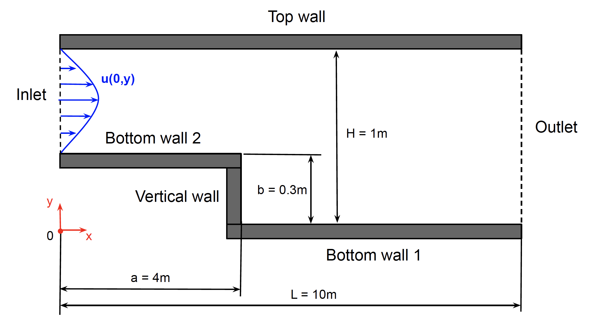
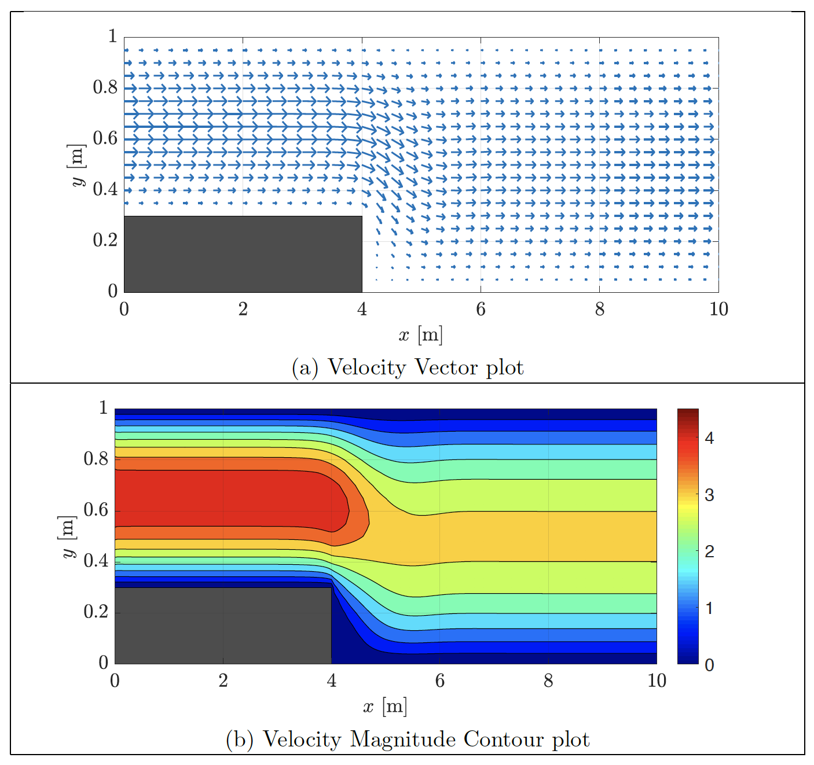

 The velocity field of the fluid moving within the top and bottom walls shown in the figure below needs to be computed. Such field, for this and any other fluid flow configuration, is defined by the continuity and momentum equations, often refered to as the incompressible Navier-Stokes equations. The incompressible form of the Navier-Stokes eqautions is presented in Eq.\eqref{Continuity} and Eq.\eqref{Momentum}. However, no general exact solution is known for these equations that can be applied to any geometry and flow characteristics, making this set of equations one of the [Millenium problems](https://www.claymath.org/millennium-problems/navier%E2%80%93stokes-equation){:target="_blank"} and its solution is worth $1M dollars. In the meantime, obtaining approximate solutions to these equations using computers is key to understand the motion of the fluids. Also, some cool tricks can be used to simplify the solution of this set of non-linear second-order partial differential equations set.  

$$
\begin{equation}
    \nabla\cdot\vec{u} = \frac{\partial u}{\partial x} + \frac{\partial v}{\partial y} = 0 \ \ \ \ \text{(Continuity equation)}
    \label{Continuity} 
\end{equation}
$$

$$
\begin{equation}
    \frac{D\vec{u}}{D t} = \frac{\partial \vec{u}}{\partial t} + (\vec{u}\cdot\nabla)\vec{u} = -\frac{1}{\rho}\nabla P + \nu \nabla^2\vec{u} \ \ \ \ \text{(Momentum equation)}
    \label{Momentum} 
\end{equation}
$$

As presented in Eq.\eqref{Continuity} and Eq.\eqref{Momentum}, the Navier-Stokes equations describe a set of two equations with four unknown, i.e. one unknown for the pressure $P$ and the each velocity component along each spatial direction $\vec{u} = [u, v, w]$. Then, we would need additional equations to be able to find a unique solution for all the unknowns, yet there is another simplified approach. Let's consider a two-dimensional flow configuration ($w = 0$) in the laminar regime, i.e. the fluid moves as layers sliding on top of each other. Then the Navier-Stokes equations can be rewritten as presented in and Eq.\eqref{Poisson} and Eq.\eqref{Vorticity_momentum}, defining a set of two equations with two unknowns, which is now complete and ready to be solved. The unknowns in this new set of equations corresponds to the vorticity $\omega$ and the stream function $\psi$, where the name of vorticity-stream function formulation comes from.

$$
\begin{equation}
    -\omega = \nabla^2\psi
    \label{Poisson} \ \ \ \ \text{(Poisson equation)} 
\end{equation}
$$

$$
\begin{equation}
    \frac{D\omega}{D t} = \frac{\partial \omega}{\partial t} + \frac{\partial \psi}{\partial y}\frac{\partial \omega}{\partial x} - \frac{\partial \psi}{\partial x}\frac{\partial \omega}{\partial y} =  \nu \nabla^2\omega \ \ \ \ \text{(Vorticity equation)}
    \label{Vorticity_momentum} 
\end{equation}
$$

Finally, we can solve numerically the vorticity-stream function form of the Navier-Stokes equations and then translate the results back to the variables in the original formulation, namely the velocity components and pressure. We can then plot the velocity field of the flow within the walls as shown below:

[Click here](https://drive.google.com/file/d/1I7gCmSa_8qfnW2QWEyRHudK5kmpFJgJL/view?usp=sharing){:target="_blank"} to see the full project report.

[home](/index.html)