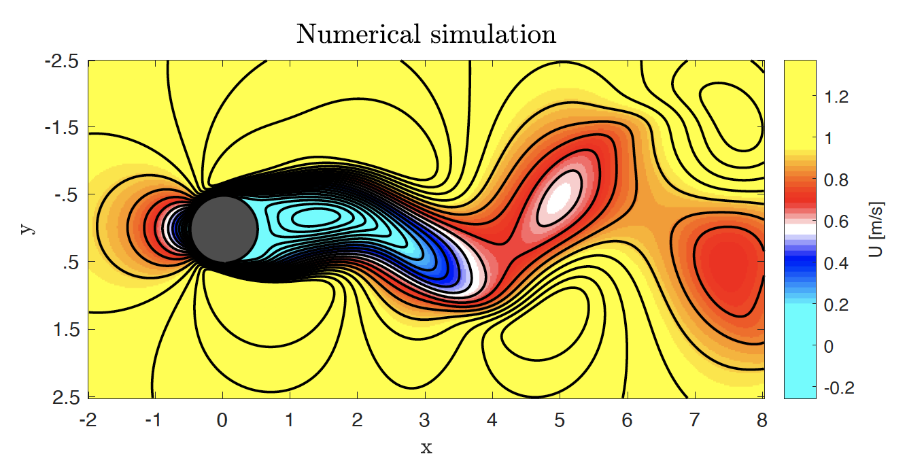
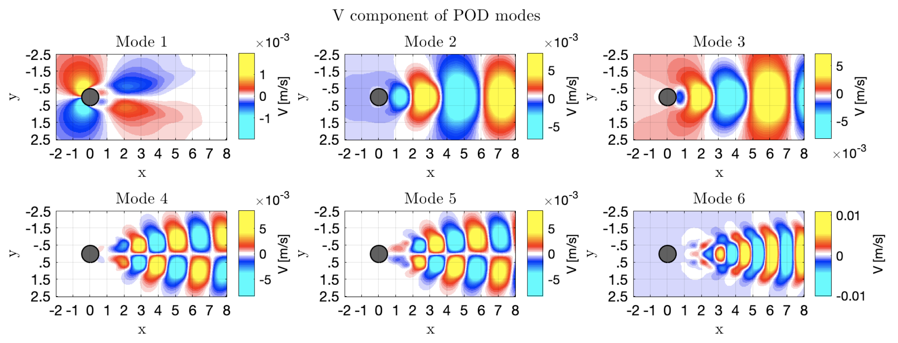
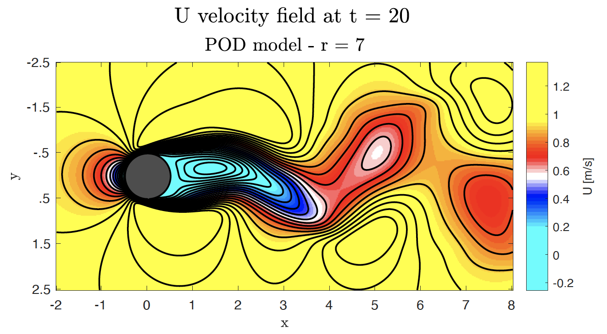
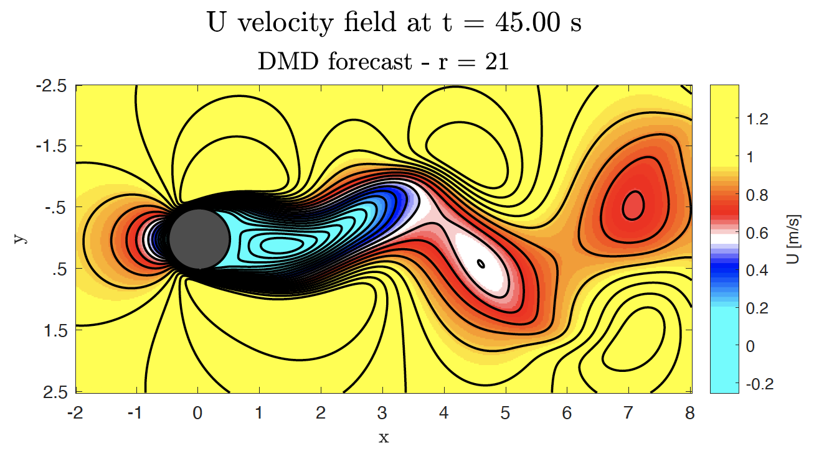
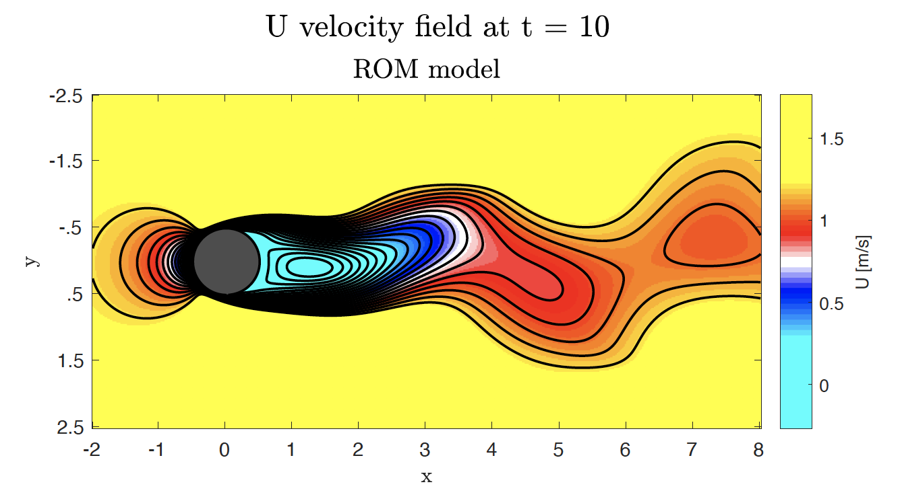

 Let's imagine that we are interested in knowing how a particular fluid moves around an infinitely long cylinder. Then we conduct a detailed numerical simulation to predict the velocity of the fluid and we collect snapshots in time as the one shown below. 

Then we can put all these snapshots together into a dataset defined by a matrix. This matrix can then be decomposed by means of the Proper Orthogonal Decomposition (POD), which extracts different structures governing the flow field in time, called POD modes, and sorts them according to their energy content, defyning energy as the amount of information from the flow field contained into each mode. The figure below shows the six most energetic modes contained in the time series of the vertical velocity component of a particular solution for the flow over a cylinder problem.

Then, after we have decomposed the dataset, we can select the first $r$ POD modes to do some cool computations, such as reconstructing the original solution but discarding any information contained after the eight POD mode:

Or comming up with another decomposition, namely the Dynamic Mode Decomposition (DMD), which allows to make predictions within certain accuracy for the flow field at times outside of the timeframe provided in the input dataset:

Or defining a set of differential equations built from the POD modes, known as a Reduced Order Model (ROM), that defines a data-driven approach to making predictions about the flow field that is based on the already collected observations, rather than making predictions based on the solution of the governing equations of fluid flow. This set of differential equations can then be solved and used to make predictions for the flow field in time:

 [Click here](https://drive.google.com/file/d/19VUwlhD9F1lEawsQcVyYIJQlMpoD35aS/view?usp=sharing){:target="_blank"} to see the full project report.

[home](/index.html)