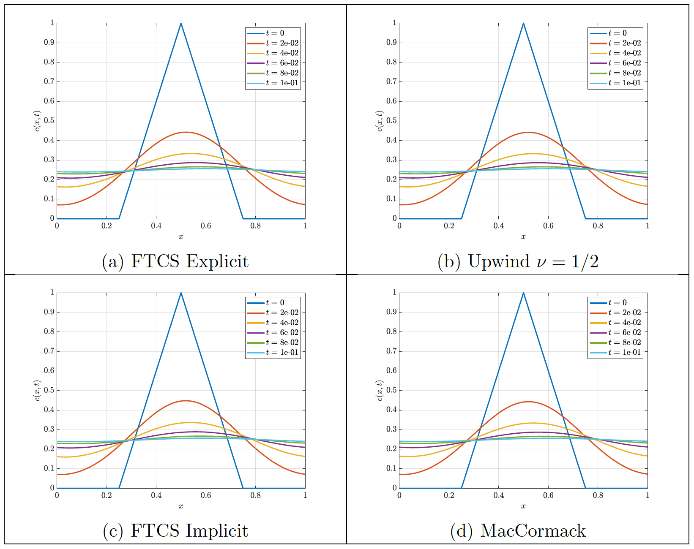

The [Burger's equation](https://en.wikipedia.org/wiki/Burgers%27_equation) is a fundamental equation in fluid mechanics corresponding to a second order non-linear partial differential equation. The simplified linear case models the transport of a property $c$ both by convection with a constant velocitu $u$ diffusion with diffusivity $\Gamma$. Particularlym such property $c$ can respresent a wave traveling withing a domain, as seen in the figures below. In this project, the numerical stability of the solution of the linear Burgers eqaution was analyzed for several discretization schemes. Numerical difussion was observed on top of the physical diffusion governed by $\Gamma$ for certain discretization schemes. The addition of such numerical error can impact the results greatly. [Click here](https://drive.google.com/file/d/1aUn4bhVkkIreHSXH-TKJWZP0NEK0CMdt/view?usp=sharing) to see the full project report.

$$
\begin{equation}
    \frac{\partial c}{\partial t} + u\frac{\partial c}{\partial x} = \Gamma \frac{\partial^2 c}{\partial x^2}
    \label{Burgers}
\end{equation}
$$

### Inviscid case ($\Gamma = 0)$

### Viscous case ($\Gamma = 1)$

