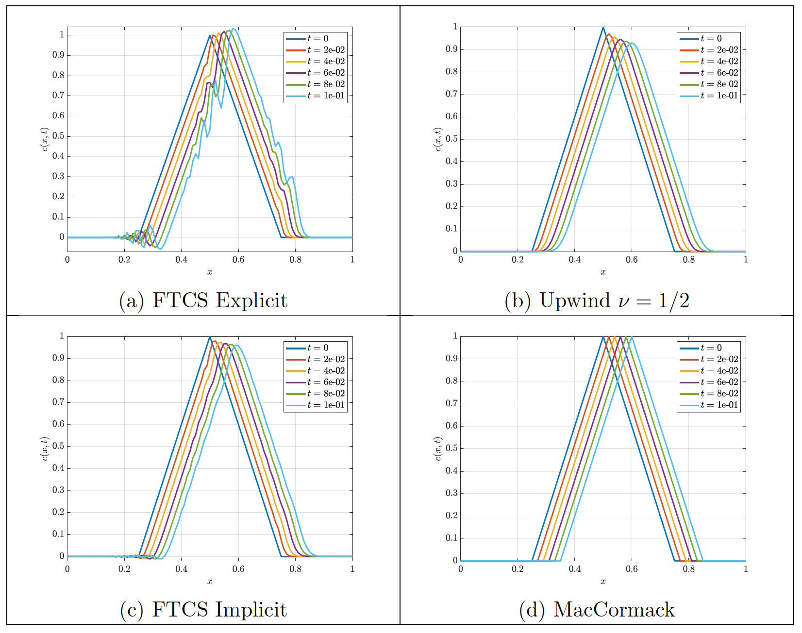

 The [Burger's equation](https://en.wikipedia.org/wiki/Burgers%27_equation) is a fundamental equation in fluid mechanics corresponding to a second order non-linear partial differential equation. The simplified linear case Eq.\eqref{Burgers} models the transport of a property $c$ both by convection with a constant velocity $u$ and diffusion with diffusivity $\Gamma$. Particularly, such property $c$ can respresent a wave traveling within a domain, as seen in the figures below. In this project, the stability of the numerical solution of the linear Burgers eqaution was analyzed for several discretization schemes. Numerical difussion was observed on top of the physical diffusion governed by $\Gamma$ for certain discretization schemes. The addition of such numerical error can greatly impacts the results and shall be controlled from the numerics of the solution. 

$$
\begin{equation}
    \frac{\partial c}{\partial t} + u\frac{\partial c}{\partial x} = \Gamma \frac{\partial^2 c}{\partial x^2}
    \label{Burgers}
\end{equation}
$$
 
 [Click here](https://drive.google.com/file/d/1aUn4bhVkkIreHSXH-TKJWZP0NEK0CMdt/view?usp=sharing){:target="_blank"} to see the full project report.

### Inviscid case ($\Gamma = 0)$

### Viscous case ($\Gamma = 1)$

[home](/index.html)