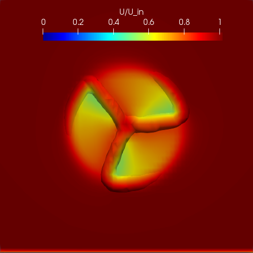
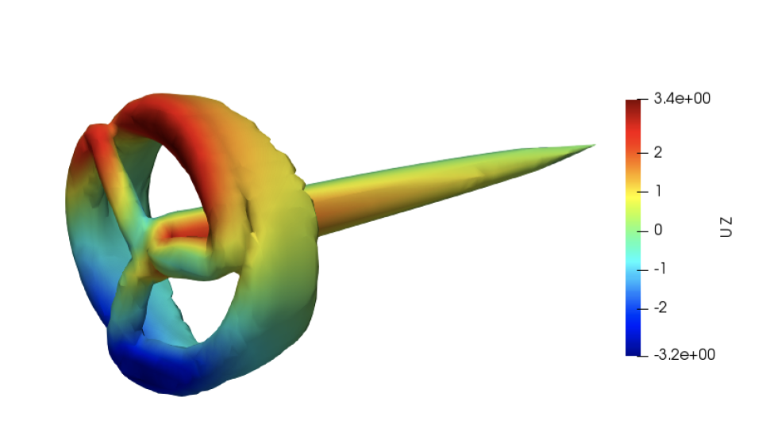
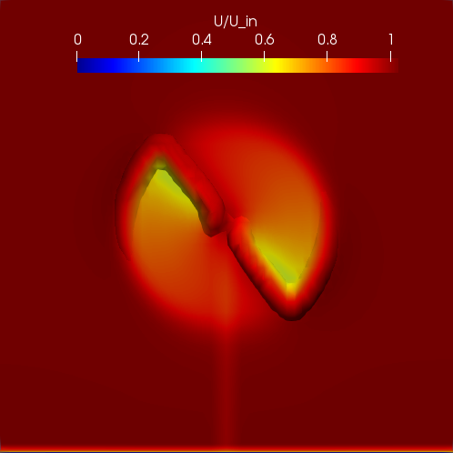
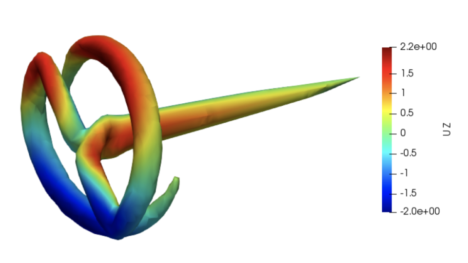

# Wind Turbine Aerodynamic Simulations

Wind energy generation has recently gained a lot of popularity as an alternative source of large-scale electricity generation, but we still need to work harder to make them a more reliable power generation source. Advances on computational resources have provided great tools for aiding the design of wind turbines, opening the door to assessing many design configurations inexpensively using computers. These computational tools, however, are still under development and their accuracy for predicting the airflow around wind turbines under several configurations still requires to be validated, especially regarding the current trend of making bigger rotors that are placed higher away from the ground. Do you think we can propose new designs that are more efficient than the [standard three-bladed model](https://flic.kr/p/aa1uWJ){:target="_blank"}? Well, I've been intrigued by that question lately and here are some interesting results.

## Three bladed wind turbine in upwind configuration

## Two bladed wind turbine in downwind configuration

Stay tuned for more updates!

[home](./)
